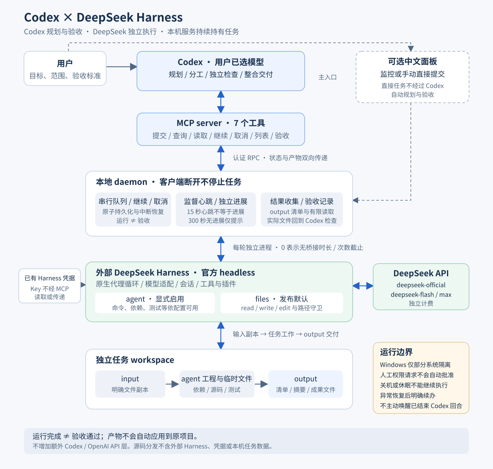

# 架构与接口

## 1. 定位与数据流

这是一个让 **Codex 委派、DeepSeek 执行、Codex 验收** 的本地连接程序。它复用外部 Harness 的代理循环、工具插件、会话和凭据管理，增加统一 MCP 接口、后台队列、持续监督、产物读取及独立验收记录。



图的可编辑源文件是 [architecture.mmd](architecture.mmd)。实线表示常用任务流程，虚线表示可选网页入口；任务结果通过查询返回 Codex，并不是后台主动唤醒 Codex。

### 两个入口

**Codex/MCP 是主入口。** 你在 Codex 中交代工作，客户端当前选择的模型决定如何拆分、委派和检查。连接程序没有额外调用 Codex/OpenAI API，也不改变主模型。DeepSeek 在另一条独立计费的 API 路径上执行。

**网页是可选入口。** 它既能监控 Codex 已提交的任务，也能让用户直接给 DeepSeek 提交任务。直接提交不经过 Codex 自动规划、自动检查和自动验收。用户可以随后让 Codex 读取这项已有任务再验收。

## 2. 模块组成

| 模块 | 源文件 | 责任 |
| --- | --- | --- |
| MCP 服务 | [mcp-server.mjs](../src/mcp-server.mjs)、[tools.mjs](../src/tools.mjs) | 用官方 MCP SDK 提供七个 stdio 工具、严格参数定义和受控返回。 |
| 本机 RPC 客户端 | [client.mjs](../src/client.mjs) | 按需连接或启动 daemon，读取本地认证信息并转发操作。 |
| daemon | [daemon.mjs](../src/daemon.mjs) | 持有后台任务、提供 loopback HTTP 接口和可选面板，管理单实例及停止流程。 |
| 任务管理 | [task-manager.mjs](../src/task-manager.mjs) | 串行队列、幂等请求、模式、继续、取消、状态、持久化和独立验收。 |
| Harness 运行器 | [harness-runner.mjs](../src/harness-runner.mjs)、[child-lifecycle.mjs](../src/child-lifecycle.mjs) | 启动官方 headless、复用凭据、解释事件、执行可选限制并等待真实退出。 |
| 持续监督 | [harness-monitor.mjs](../src/harness-monitor.mjs) | 记录监督心跳及经过节流的模型/工具进展元数据，不保存原始推理。 |
| 文件工作区 | [workspace.mjs](../src/workspace.mjs) | 验证及复制明确输入、收集 output 清单、分页读取文件和检查变更。 |
| files 守卫 | [harness-guard.mjs](../src/harness-guard.mjs) | 在 files 模式隐藏其他工具并检查文件范围、链接、权限与上限。 |
| Windows 目录初始化 | [windows-workspace.mjs](../src/windows-workspace.mjs) | 经明确配置与授权后，在新 agent 任务的空 workspace 上补足根目录权限并调用上游公开 ACL 初始化，随后才创建输入和输出。 |
| 本机配置 | [config.mjs](../src/config.mjs)、[setup.mjs](../scripts/setup.mjs) | 解析本机路径和模型设置，生成项目 MCP 配置；不修改全局配置。 |
| 可选面板 | [public](../public)、[launcher.mjs](../src/launcher.mjs) | 展示任务、监督与产物；支持用户直接提交、继续、取消和记录验收。 |
| Codex 操作规则 | [SKILL.md](../.agents/skills/codex-ds-harness/SKILL.md) | 指定委派范围、请求去重、监督判断、产物核验和整合方式。 |

后台服务持有任务，而不是 MCP 或浏览器进程持有任务。因此客户端断开不会自动终止已经提交的执行。当前队列同时运行一个任务；每轮使用独立 Harness 子进程，继续同一任务时使用原会话与工作目录。

## 3. 执行模式和启用条件

### files：发布默认

只向模型提供 `read`、`write`、`edit`。读取限于该任务的 input/output，写入与编辑限于 output。每次执行再检查普通文件、真实路径、符号链接、目录联接、硬链接、设备路径和 Windows 替代数据流，防止常见的目录越界。

这种模式适合明确文件上的整理、转换和草稿，不提供 shell、浏览器、联网检索或子代理。

### agent：显式启用的原生编码代理

启用后，运行器不施加 files 的三工具清单，而是使用 Harness 原生 headless 工具和插件。模型可在自己的 workspace 中建立工程、调用命令、安装获允许的项目依赖和运行测试；实际可用工具取决于外部 Harness 的安装与配置。

发布示例使用 `defaultMode: files`、`enableNativeAgent: false`。决定允许本机原生代理后，在保留其他配置字段的前提下加入或修改：

```json
{
  "enableNativeAgent": true,
  "defaultMode": "agent",
  "maxRuntimeSeconds": 0,
  "maxToolCalls": 0,
  "maxStreamBytes": 0
}
```

`enableNativeAgent` 控制是否允许 agent，`defaultMode` 控制请求省略 mode 时的选择；也可以启用 agent 但保持 files 默认。未启用时请求 agent 会明确报错，不能仅通过改变 defaultMode 绕过。

agent 沿用原生 `workspace-write` 和审批策略。headless 没有人工审批应答器，遇到必须由人批准的权限升级会失败关闭，不自动放行。技能、项目说明和子代理等能力遵循 Harness 原生机制；仓库中存在某插件不代表当前 profile 已经启用且无需配置。

### 工作目录与真实隔离

两种模式都建立独立任务目录，输入按清单复制，交付放 output。agent 的工程、依赖和临时文件可在 workspace 其他位置，只有 output 会作为 MCP 产物清单收集。连接程序不自动将结果应用到正式项目。

**独立目录不等于完整的操作系统隔离。** Windows 原生沙箱只有部分隔离，读取、网络和进程可见性并非全部受限。本项目不把 agent 描述为只能看到 input/output；那是 files 工具守卫的访问规则。`readRoots` 约束输入复制来源，也不是 agent 操作系统级读权限白名单。

旧任务无 mode 时按 files 解读。任务继续保留原 mode、limits、会话及目录，不能在继续请求中升级模式或新增输入。新模式、新输入应创建新任务。

### 可选 Windows 目录权限初始化

有些 Windows 目录虽然由当前用户拥有，但只继承了 Modify 权限，不含上游设置目录安全信息所需的 `WRITE_OWNER`，运行命令时可能出现 `SetNamedSecurityInfoW` / `Win32 5`。如果原生初始化此前失败，已经创建的 input/output 还可能缺少本应继承的官方 capability 权限和 Low 完整性标签。这是特定目录权限及创建顺序的问题，不是每台 Windows 机器都需要修复。

`prepareWindowsWorkspaceAcl` 发布默认 false。明确授权这项局部权限变更后，可在本机设置 true；它只用于新 agent 任务的工作区准备，不是 runner 每轮启动或继续任务时的递归修复。输入检查通过后，准备顺序如下：

1. 创建空的任务 workspace，验证它恰好是本任务目录、路径及祖先无链接、当前用户是原 owner。
2. 只为 workspace 根目录的原 owner 补充不向后代继承的 `WRITE_OWNER`；该 owner 已有对应许可时不重复添加，不改变 owner。
3. 调用已安装 Harness 的公开 `AclWriteGrant` 与 `workspaceWriteSid`，正式初始化这个空根目录。
4. 初始化成功后才创建 input/output 并复制输入，使新对象正常继承官方 capability 权限和 Low 完整性标签。

files 模式不执行这项准备；继续任务沿用已有且已正确初始化的目录。初始化不向后代追加 `WRITE_OWNER`，不递归接管所有权，不修改全局 ACL，也不关闭或降低原生沙箱。根目录的权限和官方可继承设置是持久的文件系统变更；关闭配置只停止后续新任务的准备，不会自动撤销已经写入的权限。

helper 拒绝非空 workspace、owner 不符、拒绝规则、路径校验失败或缺失的上游 ACL 模块，且不会为通过检查而删除已有文件。相关错误包括 `NONEMPTY_WORKSPACE`、`WORKSPACE_OWNER_MISMATCH`、`WORKSPACE_ACL_DENIED`、`WORKSPACE_PATH_MISMATCH`、`WORKSPACE_ACL_PREPARE_FAILED`、`WINDOWS_SANDBOX_UNAVAILABLE` 和 `WINDOWS_SANDBOX_PREPARE_FAILED`。

已有错误目录需要单独诊断。先保留原数据和备份；如明确决定重建，应使用新对象按字节复制文件并核对哈希，避免把旧权限随对象带回。此过程不由初始化 helper 自动执行，不自动删除旧数据。具体机器的无 Key 检查及真实 agent 结果由验收记录报告，配置说明本身不代表实测已通过。

## 4. 长任务、进展和监督

`maxRuntimeSeconds=0` 表示不设置连接层的运行时间截止；`maxToolCalls=0` 表示不设置连接层的工具次数截止。非零值则限制单轮运行，并受项目非零上限约束。这不移除文件、协议、错误和权限检查，也不保证外部服务无限上下文或无限可用。

协议流另有 `maxStreamBytes`：发布默认 4194304 字节（4 MiB），用于限制累计 stdout JSON 流；长任务可显式设置为 0，表示不按累计协议流大小截断，仍逐条解析而非保存全量流。单条消息上限 256 KiB 等检查继续生效。它与 output 产物大小是不同限制，agent 的工作目录也没有因此获得磁盘配额。

任务正常完成仍会退出；服务不会因为设为 0 就自动不断续问模型。`get_task.waitSeconds` 最多 25 秒只是单次查询等待，与任务可运行多久无关。

监督每 15 秒更新心跳，只表示父监督程序观察子进程生命周期的本地信号，不保证子进程事件循环响应。进展从模型流、工具开始/结束、后台作业输出等元数据中单独识别，流进展按 5 秒节流。原始推理及工具输出正文不通过监督信号保存。心跳不会刷新“最后进展”时间。

任务摘要中的监督字段为：

| 字段 | 含义 |
| --- | --- |
| `lastHeartbeatAt` | 最近监督心跳时间；不等同模型进展。 |
| `lastProgressAt` | 最近可识别进展时间。 |
| `health.state` | `healthy`、`suspected_stall` 或 `stopped`。 |
| `health.lastHeartbeatAt` / `lastProgressAt` | 上述时间在健康摘要中的副本。 |
| `health.lastProgressKind` | 最近进展类别，如模型流或工具活动。 |
| `health.activeToolCount` | 最近已观察到仍活动的工具数量，可包含原生并发子任务的工具。 |
| `health.stallWarningSeconds` | 无进展提醒阈值，默认 300 秒。 |

超过阈值只是“疑似停滞”，不会因此直接杀任务。安静的长命令也可能合法运行，Codex 应结合活动工具和任务目标判断。进程健康、任务成功和独立验收是三件不同的事。

本地等待与心跳不生成模型 token。Codex 被客户端唤醒后读取和判断状态消耗 Codex 用量，DeepSeek 执行使用 DeepSeek API 额度。**此连接层不能主动唤醒已结束的 Codex 回合。** 自动定期跟进需要客户端调度；这里提供查询接口，没有实现该调度能力。

电脑休眠期间不能持续执行，恢复后连接可能失败；关机或 daemon 异常退出也无法继续工作。服务重启把遗留活动任务标为 interrupted，不自动重放。用户或 Codex 先查产物，有会话记录时明确继续，没有会话时重新提交。

## 5. 七个 MCP 工具

项目配置生成服务名 `codex_ds_harness`。下列为服务内部名称，客户端可能添加名称前缀。接口不接受 Key，不为一次调用切换 Codex 模型；DeepSeek 路由来自本项目配置。

### submit_task

提交任务并立即返回摘要，包含任务编号；它表示请求已接受，不表示执行完成。

| 参数 | 约束与行为 |
| --- | --- |
| `instruction` | 必需，1–32000 字符且不全为空白。写明目标、产物与验收标准。 |
| `inputs` | 可选，最多 30 个明确的绝对普通文件路径；不接受目录。 |
| `mode` | 可选，`agent` 或 `files`；省略时取 defaultMode，agent 需已启用。 |
| `requestId` | 建议提供，8–128 位字母、数字、点、横线或下划线。一次逻辑请求保持相同。 |
| `maxRuntimeSeconds` | 可选，非负整数。0 为无桥接时长截止；不能绕过项目的非零上限。 |
| `maxToolCalls` | 可选，非负整数。0 为无桥接次数截止；不能绕过项目的非零上限。 |

示意参数，调用前替换路径占位：

```json
{
  "instruction": "读取 input/numbers.json，计算数量、总和、平均值，交付 output/result.json 和 output/说明.md。",
  "inputs": ["<项目目录绝对路径>/examples/numbers.json"],
  "mode": "files",
  "requestId": "numbers-report-001",
  "maxRuntimeSeconds": 0,
  "maxToolCalls": 0
}
```

摘要包含 `mode` 和 `actualMode`，反映实际登记的模式。相同 requestId 与相同参数返回既有任务，不新增执行；编号复用于不同参数会报冲突。编号应在网络调用前保留，响应不明确时先查询或用原编号恢复，不换号盲目重发。

### get_task

参数为 `taskId`、可选 `afterEvent` 和 `waitSeconds`。事件游标为非负整数，默认 0；等待为 0–25 秒，默认 0。

返回 `{ task, events, nextCursor, eventsTruncated }`，task 包含模式、限制、会话、运行、验收及监督摘要。下次使用 nextCursor 增量读取。保留事件窗口有限，eventsTruncated 表示更早事件不在窗口中，不能以此声称完整日志已经读取。

### get_result

参数为 `taskId` 及可选 `path`、`offset`、`maxBytes`。不传 path 时返回摘要和产物清单；传 path 时读取 output 内一个文件的有限片段。

- path 相对 output，例如 `result.json`，不写成 `output/result.json`，也不能为绝对或跨目录路径。
- offset 是非负字节偏移，默认 0；maxBytes 默认 12000，最多 24000。
- 返回 `task`、`summary`、`artifacts`、`review`、`changedSinceRun`、`reviewStale`，指定文件时附带 `file`。
- 产物含 `path`、`size`、`sha256`。文本在 `file.content`，后续可从 `file.nextOffset` 分页读取。二进制产物应在本地用对应程序查看。

summary 是模型最终说明，不能替代独立核验。changedSinceRun 比较当前产物与运行结束时记录；reviewStale 提示验收后产物已改变，需要重新检查。agent 在 workspace 其他位置的工程文件不会自动列入这里，应按任务要求将交付副本放 output。

### continue_task

参数为 `taskId`、新的 `instruction` 和可选 `requestId`。复用已结束任务的会话及工作目录，并重新排队；活动中的任务及没有会话编号的任务不能继续。若已关闭 enableNativeAgent，原 agent 任务也不能继续，服务会明确拒绝。

补充要求应说明修改哪些产物、修改目标和验收标准。继续保留原模式和限制，不新增输入，不换会话；验收重新变为 pending。interrupted 在检查已有产物后可以显式继续，服务不自动续跑。

### cancel_task

参数仅 taskId。排队任务移出队列，活动任务进入 cancelling 并等待真正退出。保留此前写入文件，不自动回滚修改。取消请求发出不等于清理已经完成，应确认终态。

### list_tasks

无参数，返回 `{ tasks: [...] }`，按创建时间倒序列出近期任务摘要。可用于客户端重新连接后定位既有任务；完整事件及文件分别查询。

### review_task

参数为 taskId、status 和 note。status 为 `accepted` 或 `needs_changes`；note 为 1–4000 字符实际检查说明。

只能在运行结束后记录验收，accepted 仅允许 succeeded。记录包含当时产物清单，但并不代表服务自动测试了算法或文稿；记录人应写明自己的检查依据。网页手动验收也不应冒充 Codex 自动验收。

### 返回和错误

MCP 返回结构化内容及简短文本，错误明确标记，不将服务不可用包装为空任务。常见错误包括 agent 未启用、输入拒绝、幂等冲突、活动任务、缺少可续会话、输出超限和访问失败。stdout 只承载协议，诊断走 stderr；凭据和原始推理不作为普通错误内容输出。

## 6. 状态与持久化

| 运行状态 | 含义 |
| --- | --- |
| `queued` | 已登记，等待执行。 |
| `running` | Harness 正在运行，进展另看 health。 |
| `cancelling` | 正在等停止与清理。 |
| `succeeded` | 执行成功结束，仍需独立验收。 |
| `failed` | 启动、执行、退出或交付检查失败。 |
| `cancelled` | 已取消。 |
| `timed_out` | 达到配置的非零时长上限后结束。 |
| `interrupted` | 恢复时发现上次服务退出前任务未结束。 |

验收状态独立为 pending、accepted、needs_changes。继续会重置验收，外部修改产物会使已记录验收过时。服务不会用一条最终模型回复直接代替成功退出和产物检查。

```text
config.example.json             可分发模板，不含 Key
config.json                     生成的本机配置，不发布
.codex/config.toml               生成的项目 MCP 配置，不发布
.bridge/server.json             daemon 地址和认证信息
.bridge/tasks/<id>/task.json     指令、输入、模式、轮次、监督及验收
.bridge/tasks/<id>/workspace/
  input/                        输入副本
  output/                       正式产物清单来源
  ...                           agent 工程和临时工作文件
```

任务记录使用原子写入。MCP 或浏览器断开不清空队列，关闭服务会结束活动任务。异常恢复保留事实并标 interrupted，不自动重复 API 请求。

## 7. 凭据、本机认证和数据范围

Key 保留在外部 Harness 凭据存储。运行器设置 Harness home，移除继承来的 DEEPSEEK_API_KEY 环境覆盖，由 Harness 自己加载已保存凭据；Key 不经 MCP、网页任务或配置文本复制。

每轮关闭遥测和会话上传。Bridge 的监督记录不保存原始推理；Harness 为继续会话所需的本地记录仍由其自身机制管理，不能将“关闭上传”解释为“不存在本地记录”。任务要求、复制输入、产物和验收均属于本地资料，不应整体打包公开。

daemon 仅监听 127.0.0.1 的随机端口，认证信息保存在运行状态文件。网页从启动入口获得认证片段后清除地址片段并保存在当前浏览器会话中；服务校验认证、Host 和 Origin，不开放跨源共享。该设计面向同一本机用户，不提供公网托管或对抗恶意同用户进程的强隔离。

输入仍只从明确 readRoots 复制，拒绝整目录、链接、敏感文件与检测到的疑似凭据；复制上限不会变成 agent 的整个文件系统读权限控制。output 收集上限也不是整个 agent 工程磁盘配额。

## 8. 安装、分发和维护

本仓库不打包外部 Harness、Node、安装后的依赖或个人运行数据。[配置本机.cmd](../配置本机.cmd) 使用已有 Node，选择 Harness 路径，生成本项目配置；Windows 双击流程在依赖缺失时可提示并执行锁定依赖安装。跨平台可用 [setup.mjs](../scripts/setup.mjs)，其 CLI 仅配置，不安装依赖。

原生入口基线为上游提交 [`477b4f420553e8a52c2fbccc464d7561b239c443`](https://github.com/deepseek-ai/deepseek-harness/tree/477b4f420553e8a52c2fbccc464d7561b239c443)。版本升级需重新核对启动、插件、结构化事件、取消与恢复行为。

开发命令以 [package.json](../package.json) 为准：npm ci 安装，npm run check 做静态检查，npm test 做不调用模型的测试；npm run test:live 会消耗真实 API 额度。`npm run test:ui` 需要开发者另有 Playwright 与 Edge（msedge）；可用 `PLAYWRIGHT_MODULE` 指定已有 Playwright 模块，默认依赖安装不包含它。实际测试证据与限制见 [验收记录](验收记录.md)。

当前实现提供 MCP 委派、持久任务、两模式、持续监督、继续/取消、产物核验及可选面板。主动唤醒 Codex、跨机器持续运行、公网服务、自动无限返工和所有插件自动配置，都不在已实现能力中。
